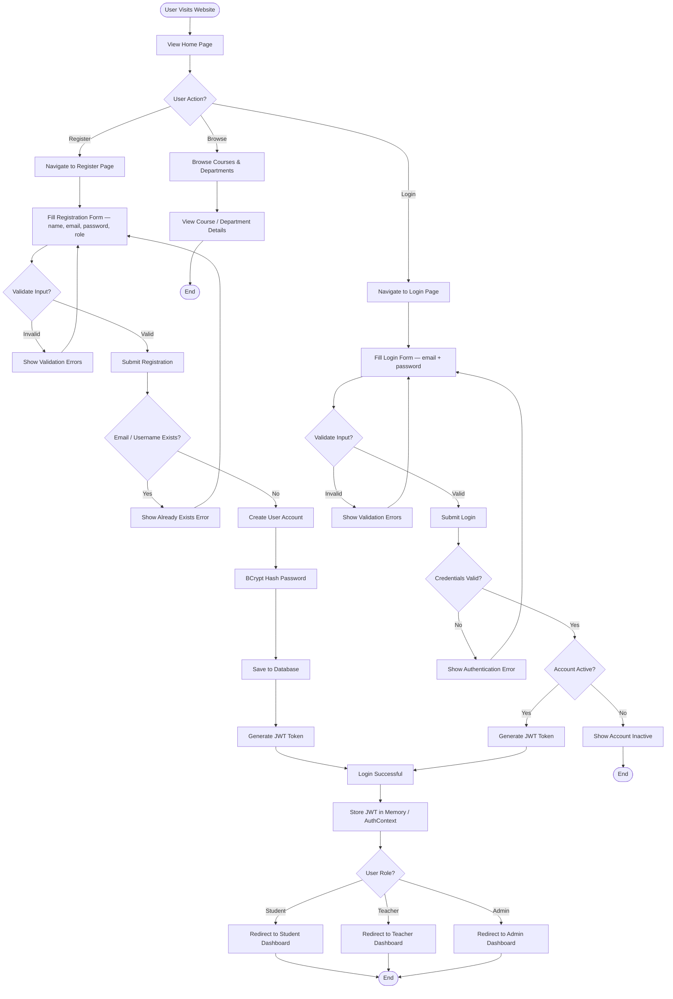

# UniSystem - Activity Diagrams

This document contains activity diagrams showing the business process flows of the UniSystem application.

## 1. User Registration & Authentication Process



## 2. Course Enrollment Process (Student)

```mermaid
flowchart TD
    Start([Student Logged In]) --> NavReg[Navigate to Registration Page]
    NavReg --> LoadCourses[Load All Available Courses]
    LoadCourses --> FilterCourses{Filter / Search?}
    FilterCourses -->|By Department| FilterByDept[Filter by Department dropdown]
    FilterCourses -->|By Name| SearchByName[Search by course name]
    FilterCourses -->|View All| ViewAll[Display All Courses]

    FilterByDept --> DisplayCourses[Display Filtered Courses]
    SearchByName --> DisplayCourses
    ViewAll --> DisplayCourses

    DisplayCourses --> SelectCourse[Click Enroll on a Course Card]
    SelectCourse --> CheckCapacity{Course Full?}
    CheckCapacity -->|Yes| ShowFull[Show Course Full badge — button disabled]
    ShowFull --> DisplayCourses

    CheckCapacity -->|No| CheckEnrolled{Already Enrolled?}
    CheckEnrolled -->|Yes| ShowEnrolled[Show Drop button instead]
    CheckEnrolled -->|No| ProcessEnroll[POST /api/enrolled-courses]

    ProcessEnroll --> SaveEnroll[Save enrollment to DB]
    SaveEnroll --> UIUpdate[Optimistic UI update — show Drop button]
    UIUpdate --> End2([End])

    ShowEnrolled --> DropDecision{Drop Course?}
    DropDecision -->|No| DisplayCourses
    DropDecision -->|Yes| ProcessDrop[DELETE /api/enrolled-courses/{id}]
    ProcessDrop --> RemoveEnroll[Remove enrollment from DB]
    RemoveEnroll --> UIUpdate2[UI update — show Enroll button]
    UIUpdate2 --> End3([End])
```

## 3. Teacher Course Management Process

```mermaid
flowchart TD
    Start([Teacher Logged In]) --> TeacherDash[View Teacher Courses Dashboard]
    TeacherDash --> TabChoice{Active Tab?}
    TabChoice -->|Active Courses| ShowActive[Show active courses grid]
    TabChoice -->|Completed Courses| ShowCompleted[Show completed courses grid]

    ShowActive --> Action{Action?}
    Action -->|Create New Course| OpenModal[Open CourseFormModal — blank form]
    Action -->|Edit Existing| OpenEdit[Open CourseFormModal — pre-filled]
    Action -->|View Students| OpenStudents[Open StudentsModal]

    %% Create Flow
    OpenModal --> FillCourseForm[Fill name, code, description, department,\nstart date, end date, credits, max students]
    FillCourseForm --> ValidateCourse{Validate?}
    ValidateCourse -->|Invalid| ShowCourseError[Show Validation Errors]
    ShowCourseError --> FillCourseForm
    ValidateCourse -->|Valid| SubmitCreate[POST /api/courses — @TeachersOnly AOP check]
    SubmitCreate --> AOPCheck{Has TEACHER role?}
    AOPCheck -->|No| AccessDenied[403 Forbidden]
    AOPCheck -->|Yes| SaveCourse[Save Course to DB]
    SaveCourse --> LogAudit[AuditLogAspect records CREATE_COURSE]
    LogAudit --> CloseModal[Close Modal]
    CloseModal --> TeacherDash

    %% Edit Flow
    OpenEdit --> ModifyCourse[Modify pre-filled form fields]
    ModifyCourse --> ValidateUpdate{Validate?}
    ValidateUpdate -->|Invalid| ShowUpdateError[Show Validation Errors]
    ShowUpdateError --> ModifyCourse
    ValidateUpdate -->|Valid| SubmitUpdate[PUT /api/courses/{id}]
    SubmitUpdate --> UpdateCourse[Update Course in DB]
    UpdateCourse --> CloseModal

    %% View Students
    OpenStudents --> LoadEnrollments[GET /api/enrolled-courses/course/{id}]
    LoadEnrollments --> ShowStudents[Display enrolled students list]
    ShowStudents --> UnEnrollAction{Un-enroll student?}
    UnEnrollAction -->|No| CloseStudents[Close Modal]
    UnEnrollAction -->|Yes| DropStudent[DELETE /api/enrolled-courses/{enrollmentId}]
    DropStudent --> ShowStudents
    CloseStudents --> TeacherDash
```

## 4. Course Chat (Messaging) Process

```mermaid
flowchart TD
    Start([Authenticated User opens Course Chat]) --> WSConnect[Connect to WebSocket — STOMP]
    WSConnect --> Authenticate{JWT valid?}
    Authenticate -->|No| Rejected[Connection Rejected]
    Authenticate -->|Yes| Subscribe[Subscribe to /topic/course/{courseId}]

    Subscribe --> LoadHistory[GET /api/messages/course/{courseId}]
    LoadHistory --> DisplayChat[Display message history — oldest first]

    DisplayChat --> UserAction{User Action?}
    UserAction -->|Type & Send| SendMsg[POST /api/messages {courseId, senderId, content}]
    UserAction -->|Receive live message| ReceiveMsg[STOMP frame arrives on /topic/course/{courseId}]
    UserAction -->|Leave chat| Disconnect[STOMP DISCONNECT]

    SendMsg --> SaveMsg[Message saved to DB]
    SaveMsg --> BroadcastMsg[Broker broadcasts to all subscribers]
    BroadcastMsg --> DisplayChat

    ReceiveMsg --> AppendMsg[Append new message to chat UI]
    AppendMsg --> DisplayChat

    Disconnect --> End([End])
```

## 5. Notification Process

```mermaid
flowchart TD
    Start([User Logged In]) --> LoadBadge[GET /api/notifications/user/{id}/unread/count]
    LoadBadge --> ShowBadge[Show unread count badge in header]

    ShowBadge --> Trigger{Event occurs?}
    Trigger -->|Push via WebSocket| PushNotif[STOMP frame arrives /user/{id}/queue/notifications]
    Trigger -->|User opens inbox| OpenInbox[GET /api/notifications/user/{id}]

    PushNotif --> IncrementBadge[Increment badge count]
    IncrementBadge --> ShowToast[Show toast / banner]
    ShowToast --> Trigger

    OpenInbox --> DisplayNotifs[Display notifications — newest first]
    DisplayNotifs --> NotifAction{Action?}

    NotifAction -->|Mark single as read| MarkOne[PATCH /api/notifications/{id}/read]
    NotifAction -->|Mark all as read| MarkAll[PATCH /api/notifications/user/{id}/read-all]
    NotifAction -->|Delete notification| DeleteNotif[DELETE /api/notifications/{id}]
    NotifAction -->|Close inbox| CloseInbox[Close panel]

    MarkOne --> UpdateUI[Update is_read in UI]
    MarkAll --> ResetBadge[Reset badge to 0]
    DeleteNotif --> RemoveFromList[Remove from notification list]

    UpdateUI --> DisplayNotifs
    ResetBadge --> DisplayNotifs
    RemoveFromList --> DisplayNotifs
    CloseInbox --> End([End])
```

## 6. Student Profile & Academic Standing Process

```mermaid
flowchart TD
    Start([Student Login]) --> StudentDash[View Student Dashboard]
    StudentDash --> Action{Select Action?}

    Action -->|View enrolled courses| ViewDashCourses[Load enrolled courses from dashboardService]
    Action -->|Browse & Enroll| NavRegistration[Navigate to Registration Page]
    Action -->|View My Courses| NavMyCourses[Navigate to Student Courses Dashboard]
    Action -->|Submit Feedback| SubmitFeedback[Submit Feedback Form]

    %% Dashboard courses widget
    ViewDashCourses --> DisplayTable[Display EnrolledCourses table with status badge]
    DisplayTable --> StudentDash

    %% Student Courses Dashboard
    NavMyCourses --> LoadEnrolled[GET /api/enrolled-courses/student/{id}]
    LoadEnrolled --> SplitByDate[Split by isCompleted endDate]
    SplitByDate --> ShowTabs[Show In Progress tab + Completed tab]
    ShowTabs --> TabSwitch{Switch tab?}
    TabSwitch -->|In Progress| ShowInProgress[Display in-progress course cards]
    TabSwitch -->|Completed| ShowCompleted[Display completed course cards]
    ShowInProgress --> NavMyCourses2([End])
    ShowCompleted --> NavMyCourses2

    %% Feedback
    SubmitFeedback --> FillFeedbackForm[Fill Feedback Form]
    FillFeedbackForm --> ValidateFeedback{Validate Feedback?}
    ValidateFeedback -->|Invalid| ShowFeedbackError[Show Validation Errors]
    ShowFeedbackError --> FillFeedbackForm
    ValidateFeedback -->|Valid| SaveFeedback[POST /api/feedbacks]
    SaveFeedback --> ShowFeedbackSuccess[Show Success Message]
    ShowFeedbackSuccess --> StudentDash
```

## 7. System Administration Process

```mermaid
flowchart TD
    Start([Admin Login]) --> AdminDashboard[View Admin Dashboard]
    AdminDashboard --> AdminAction{Select Action?}

    AdminAction -->|Manage Users| UserMgmt[User Management]
    AdminAction -->|Manage Departments| DeptMgmt[Department Management]
    AdminAction -->|View Audit Logs| ViewAudit[View Audit Logs]
    AdminAction -->|Manage Teachers| TeacherMgmt[Teacher Management]

    %% User Management
    UserMgmt --> UserAction{User Action?}
    UserAction -->|Create User| FillUserForm[Fill User Form]
    UserAction -->|Deactivate User| DeactivateUser[PATCH /api/users/{id}/deactivate]
    UserAction -->|Assign Roles| AssignRoles[POST /api/users/{id}/roles/{role}]

    FillUserForm --> ValidateUser{Validate?}
    ValidateUser -->|Invalid| ShowUserError[Show Validation Errors]
    ShowUserError --> FillUserForm
    ValidateUser -->|Valid| SaveUser[POST /api/users]
    SaveUser --> AdminDashboard

    DeactivateUser --> AdminDashboard
    AssignRoles --> AdminDashboard

    %% Department Management
    DeptMgmt --> DeptAction{Department Action?}
    DeptAction -->|Create| FillDeptForm[Fill Department Form]
    DeptAction -->|Update| UpdateDept[PUT /api/departments/{id}]
    DeptAction -->|Delete| DeleteDept[DELETE /api/departments/{id}]

    FillDeptForm --> ValidateDept{Validate?}
    ValidateDept -->|Invalid| ShowDeptError[Show Errors]
    ShowDeptError --> FillDeptForm
    ValidateDept -->|Valid| CheckDeptDup{Dept Name Exists?}
    CheckDeptDup -->|Yes| ShowDeptDupError[Show Duplicate Error]
    ShowDeptDupError --> FillDeptForm
    CheckDeptDup -->|No| SaveDept[POST /api/departments]
    SaveDept --> AdminDashboard
    UpdateDept --> AdminDashboard
    DeleteDept --> AdminDashboard

    %% Audit Logs
    ViewAudit --> FilterAudit{Filter Logs?}
    FilterAudit -->|By Username| FilterByUser[GET /api/audit-logs/username/{name}]
    FilterAudit -->|By Action| FilterByAction[GET /api/audit-logs/action/{action}]
    FilterAudit -->|By Both| FilterBoth[GET /api/audit-logs/action/{a}/username/{u}]
    FilterAudit -->|All| FilterAll[GET /api/audit-logs]
    FilterByUser --> DisplayAudit[Display Audit Logs]
    FilterByAction --> DisplayAudit
    FilterBoth --> DisplayAudit
    FilterAll --> DisplayAudit
    DisplayAudit --> AdminDashboard

    %% Teacher Management
    TeacherMgmt --> TeacherAction{Teacher Action?}
    TeacherAction -->|Create| FillTeacherForm[Fill Teacher Form]
    TeacherAction -->|Update| UpdateTeacher[PUT /api/teachers/{id}]

    FillTeacherForm --> ValidateTeacher{Validate?}
    ValidateTeacher -->|Invalid| ShowTeacherError[Show Errors]
    ShowTeacherError --> FillTeacherForm
    ValidateTeacher -->|Valid| SaveTeacher[POST /api/teachers]
    SaveTeacher --> AdminDashboard
    UpdateTeacher --> AdminDashboard
```

## Business Rules

### Authentication Rules

1. Email and username must each be unique across all users
2. Passwords are BCrypt-hashed before storage; never stored in plain text
3. JWT tokens are valid for 10 days (configurable via `jwt.expiration`)
4. Inactive accounts cannot log in
5. GitHub OAuth2 automatically creates a new user on first login

### AOP Security Rules

1. Methods annotated `@TeachersOnly` are accessible only to users with the `TEACHER` role
2. Methods annotated `@CourseTeacherOnly` are accessible only to the teacher who owns the targeted course
3. Both annotations are enforced by a Spring AOP `@Before` advice — no controller code required
4. Violations throw a `RuntimeException` which is mapped to `403 Forbidden`

### Enrollment Rules

1. Student must be authenticated
2. Student cannot enroll in the same course twice
3. Course must have available capacity (enrolled < maxStudents)
4. Enrollment and drop are immediately reflected in the UI (optimistic update via TanStack Query)

### Course Management Rules

1. Only teachers may create courses (`@TeachersOnly`)
2. Course code must be unique
3. Course must be assigned to a valid department
4. Active courses have an `endDate` in the future; completed courses have an `endDate` in the past

### Messaging Rules

1. Only authenticated users (enrolled students or the course teacher) may send messages
2. Messages are ordered ascending by `createdAt` for chronological display
3. Real-time delivery is via STOMP WebSocket; history is fetched via REST

### Notification Rules

1. Notifications are per-user; each user sees only their own inbox
2. `is_read` defaults to `false`; updated via `PATCH` (single) or bulk endpoints
3. Unread count is used for the header badge
4. Live notifications are pushed over WebSocket to the user's personal queue

### Audit Logging Rules

1. Sensitive operations (create, update, delete) are logged automatically via `@AuditLog` + AOP
2. Each log entry records `actionType`, `entityName`, `details`, and `createdAt`
3. Audit logs are read-only through the API; entries cannot be edited

### Feedback Rules

1. Only authenticated users can submit feedback
2. Feedback must include the user's role label
3. All feedbacks are publicly visible on the Home page
