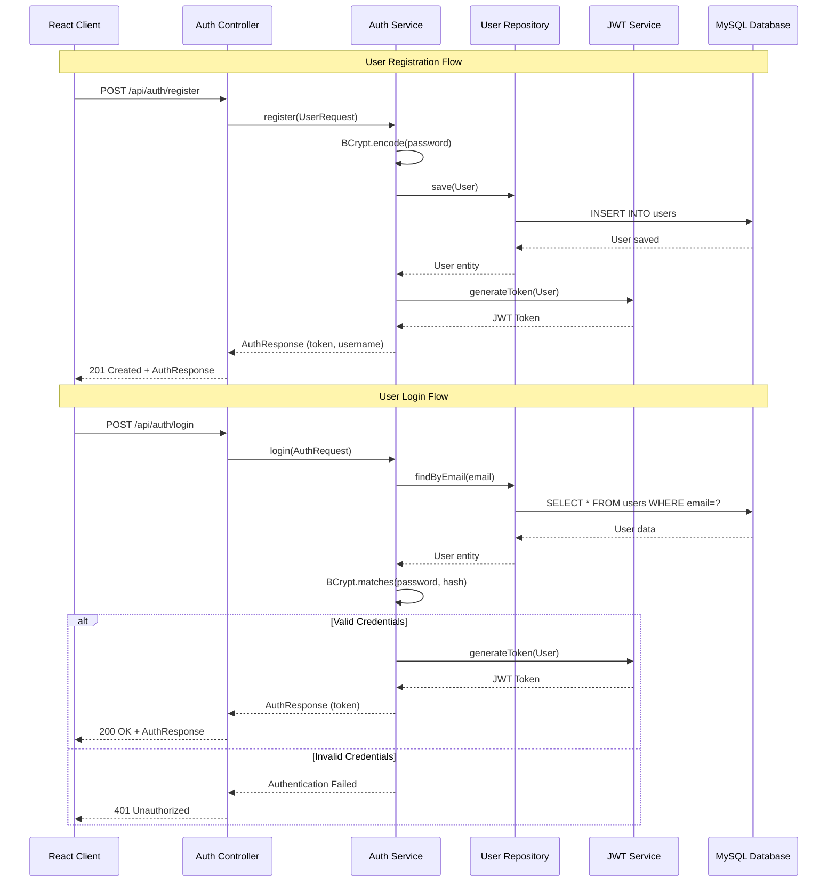
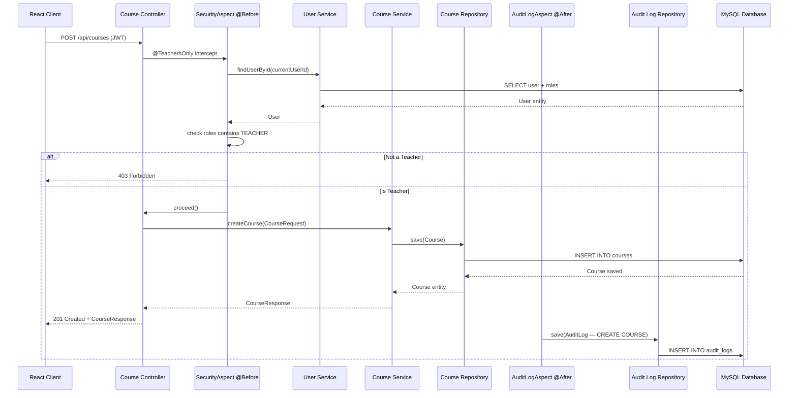
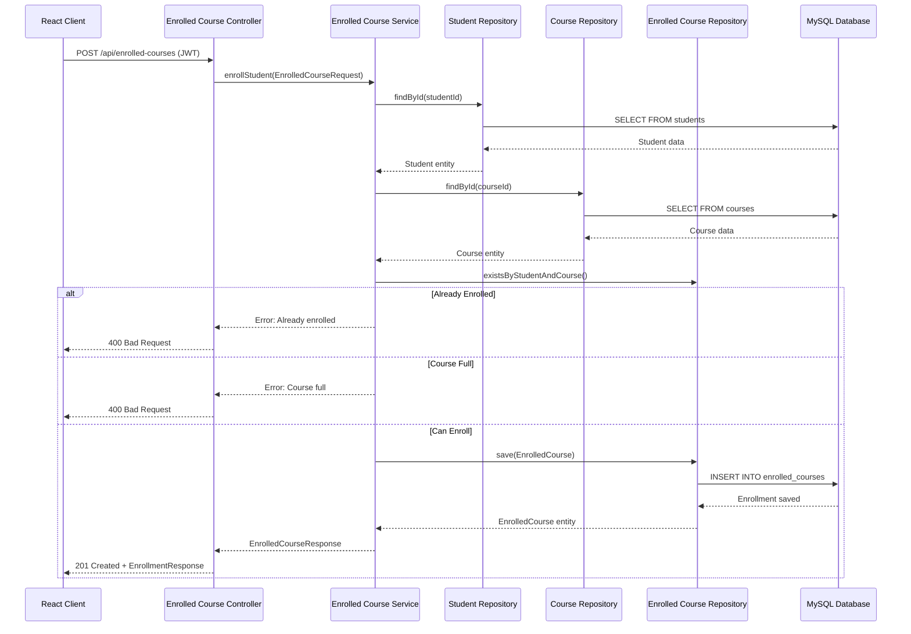
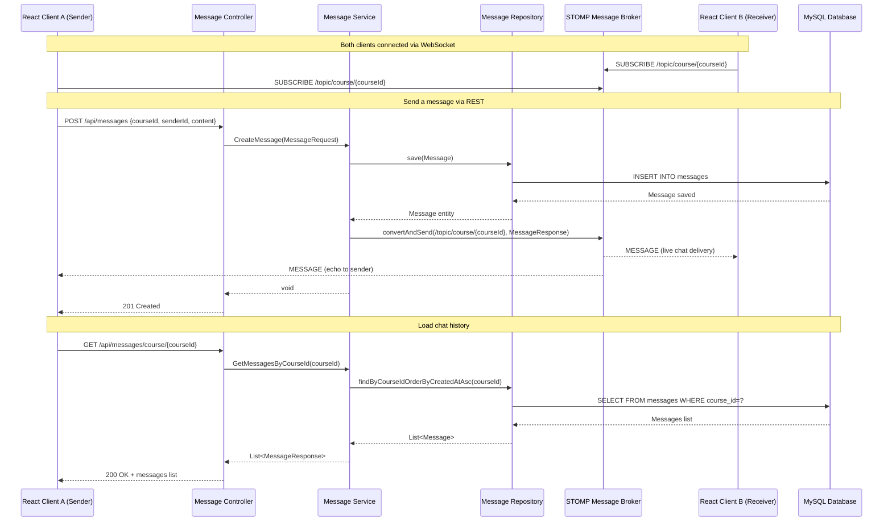
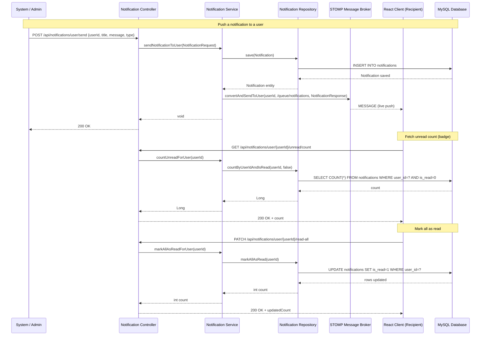
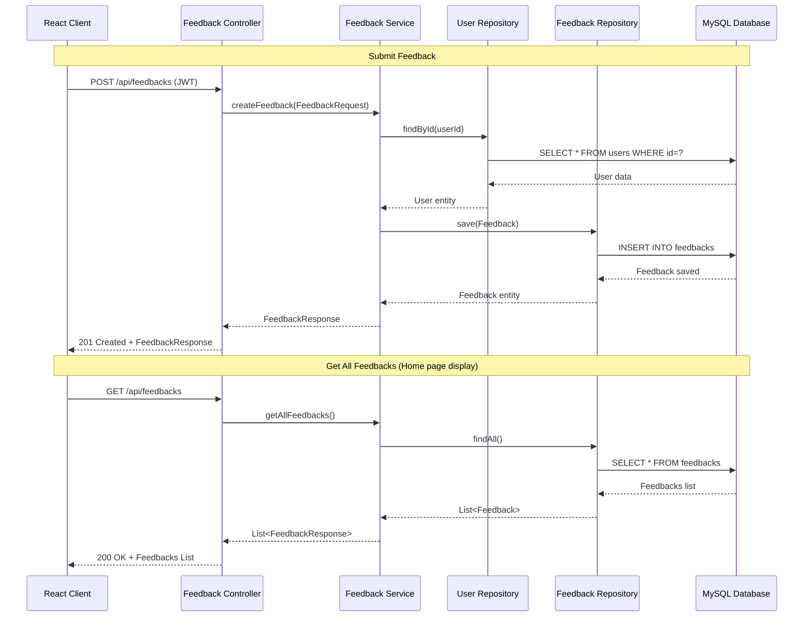
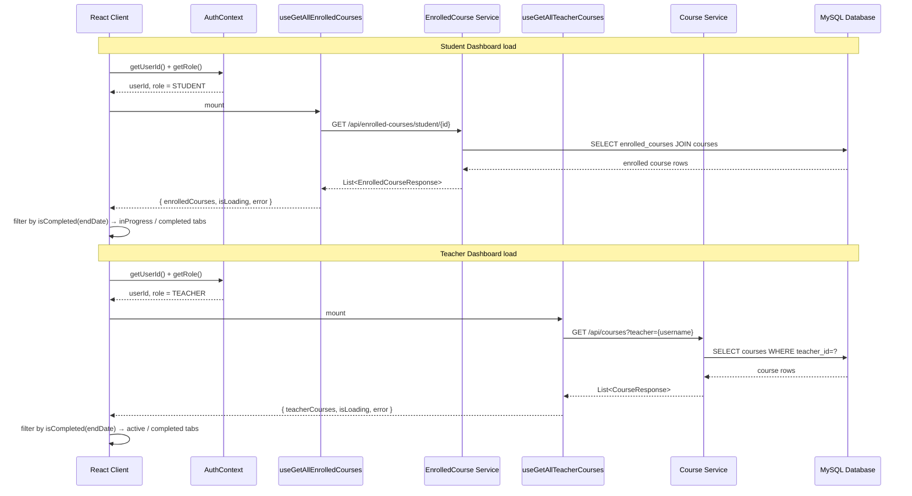

# UniSystem - Sequential Diagrams

This document contains sequence diagrams illustrating the main workflows of the UniSystem application.

## 1. User Registration & Authentication Flow

## 2. AOP-guarded Course Creation (Teacher Only)

## 3. Student Enrollment Flow

## 4. Course Chat — Send & Receive Message

## 5. Notification Flow — Send & Mark as Read

## 6. Feedback Submission Flow

## 7. Dashboard Data Loading Flow

## Technology Stack

### Backend

- **Framework**: Spring Boot 3.4.2
- **Language**: Java 21
- **Security**: Spring Security + JWT (jjwt 0.11.5) + OAuth2 GitHub
- **AOP**: Spring Boot Starter AOP (security + audit aspects)
- **WebSocket**: Spring Boot Starter WebSocket (STOMP broker)
- **Database**: MySQL with Flyway V1–V7
- **Cache**: Spring Data Redis
- **API Documentation**: SpringDoc OpenAPI 2.7.0

### Frontend

- **Framework**: React 19.2.0
- **Build Tool**: Vite 7.3.1
- **Routing**: React Router DOM 7.13.0
- **Data Fetching**: TanStack Query (custom hooks)
- **Styling**: TailwindCSS 4.2.0
- **Animations**: Framer Motion 12.34.3
- **Icons**: Lucide React 0.575.0

### Infrastructure

- **Containerization**: Docker Compose (MySQL)
- **Monitoring**: Spring Boot Actuator
- **Validation**: Jakarta Validation
- **ORM**: Spring Data JPA + Hibernate
