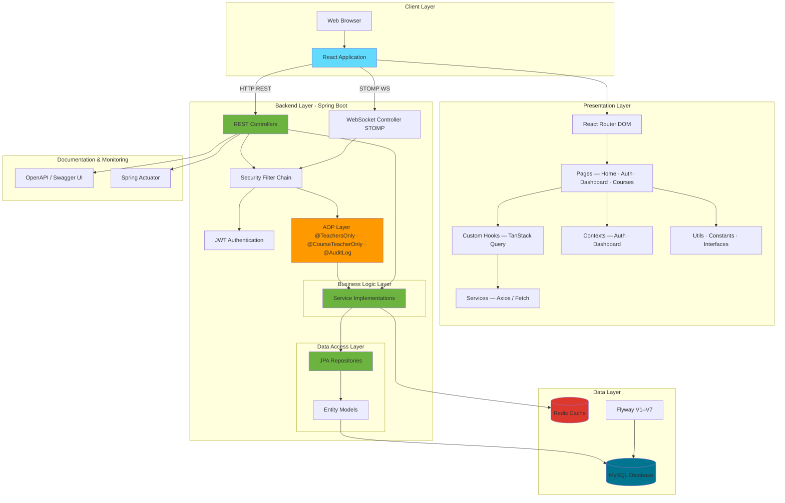
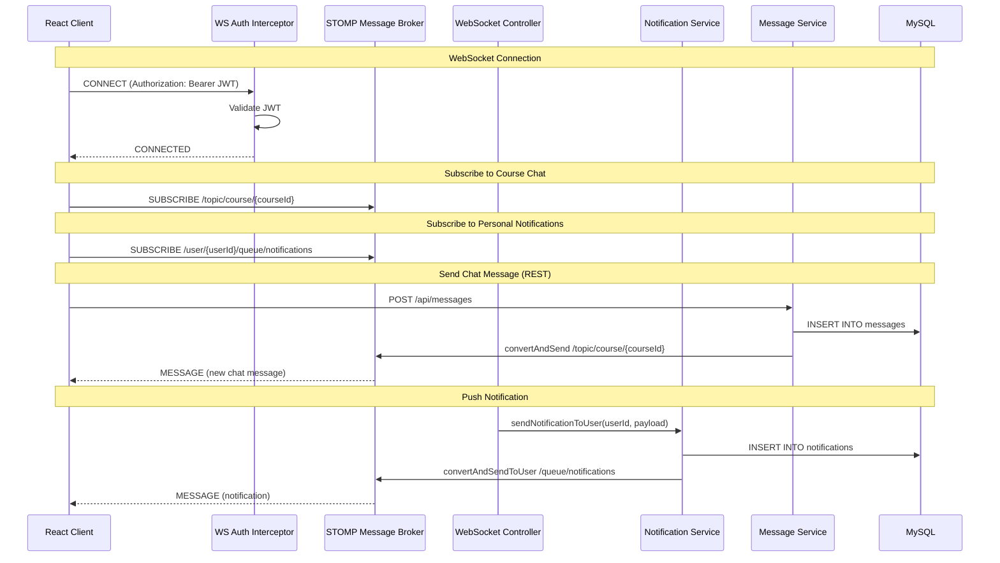
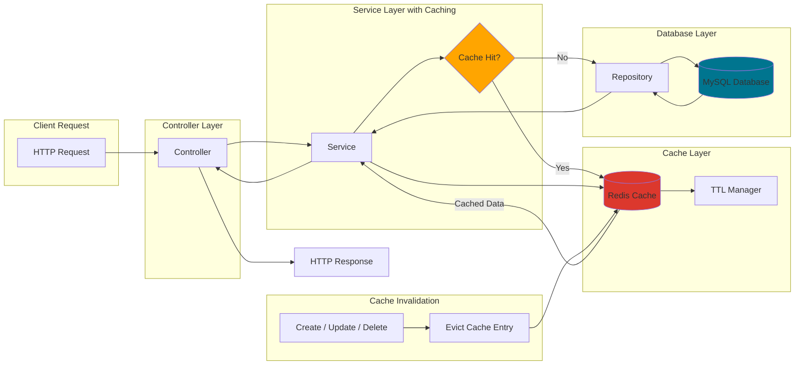

# UniSystem - System Design & Architecture

This document illustrates the complete system architecture and design of the UniSystem application.

## 1. High-Level System Architecture



## 2. Detailed Frontend Architecture

```mermaid
graph TB
    subgraph "Pages"
        HomePage[Home Page]
        AuthPage[Auth Page]
        Dashboard[Student Dashboard]
        TeacherDashboard[Teacher Dashboard]
        DashboardLayout[Dashboard Layout]
        RegPage[Registration Page]
        StudentCoursesPage[Student Courses Dashboard]
        TeacherCoursesPage[Teacher Courses Dashboard]
    end

    subgraph "Dashboard Components"
        StatsCard[Stats Card]
        EnrolledCourses[Enrolled Courses Table]
        TeachingCourses[Teaching Courses Table]
        RecentAnnouncements[Recent Announcements]
        UpcomingEvents[Upcoming Events]
    end

    subgraph "Course Components"
        AllCourses[All Courses Grid]
        CourseCard[Course Card]
        EnrolledCourseCard[Enrolled Course Card]
        TeacherCourseCard[Teacher Course Card]
        CourseFormModal[Course Form Modal]
        StudentsModal[Students Modal]
    end

    subgraph "Home Components"
        Welcome[Welcome Section]
        Departments[Departments Section]
        PopularCourses[Popular Courses]
        FeedBacks[Feedbacks Section]
    end

    subgraph "Common Components"
        Nav[Nav Bar]
        AsideNav[Aside Nav]
        Footer[Footer]
        ProtectedRoute[Protected Route]
        LoadingSpinner[Loading Spinner]
    end

    subgraph "Custom Hooks"
        CourseHooks[Course Hooks]
        EnrollHooks[Enrollment Hooks]
        DeptHooks[Department Hooks]
        FeedbackHooks[Feedback Hooks]
    end

    subgraph "Services"
        AuthSvc[authService]
        CourseSvc[courseService]
        EnrollSvc[enrolledCourseService]
        DeptSvc[departmentService]
        DashSvc[dashboardService]
    end

    subgraph "Utils & Constants"
        courseUtils[courseUtils — palette · icons · status]
        dateUtils[dateUtils — semester · toInputDate]
        annUtils[announcementUtils]
        eventUtils[eventUtils]
        avatarUtils[avatarUtils]
        deptConst[constants/departments]
    end

    subgraph "Contexts"
        AuthCtx[AuthContext]
        DashCtx[DashboardContext]
    end

    DashboardLayout --> Dashboard
    DashboardLayout --> TeacherDashboard
    DashboardLayout --> RegPage
    DashboardLayout --> StudentCoursesPage
    DashboardLayout --> TeacherCoursesPage

    Dashboard --> StatsCard
    Dashboard --> EnrolledCourses
    Dashboard --> RecentAnnouncements
    Dashboard --> UpcomingEvents

    TeacherDashboard --> StatsCard
    TeacherDashboard --> TeachingCourses

    RegPage --> AllCourses
    AllCourses --> CourseCard
    StudentCoursesPage --> EnrolledCourseCard
    TeacherCoursesPage --> TeacherCourseCard
    TeacherCoursesPage --> CourseFormModal

    HomePage --> Welcome
    HomePage --> Departments
    HomePage --> PopularCourses
    HomePage --> FeedBacks

    CourseHooks --> CourseSvc
    EnrollHooks --> EnrollSvc
    DeptHooks --> DeptSvc
    FeedbackHooks --> DashSvc

    EnrolledCourses --> courseUtils
    TeachingCourses --> courseUtils
    TeacherCourseCard --> courseUtils
    StudentCoursesPage --> dateUtils
    TeacherCoursesPage --> dateUtils
    CourseFormModal --> dateUtils
    CourseFormModal --> deptConst
    RegPage --> deptConst
    RecentAnnouncements --> annUtils
    UpcomingEvents --> eventUtils
    FeedBacks --> avatarUtils

    style AuthCtx fill:#f4a261
    style DashCtx fill:#f4a261
    style courseUtils fill:#a8dadc
    style dateUtils fill:#a8dadc
```



## 3. Backend Layer Architecture

```mermaid
graph TB
    subgraph "Controller Layer"
        AuthCtrl[Auth Controller]
        UserCtrl[User Controller]
        StudentCtrl[Student Controller]
        TeacherCtrl[Teacher Controller]
        CourseCtrl[Course Controller]
        EnrollCtrl[Enrolled Course Controller]
        DeptCtrl[Department Controller]
        FeedbackCtrl[Feedback Controller]
        AuditCtrl[Audit Log Controller]
        EventCtrl[Upcoming Event Controller]
        MsgCtrl[Message Controller]
        NotifCtrl[Notification Controller]
        WSCtrl[WebSocket Controller]
    end

    subgraph "AOP Layer"
        SecurityAspect[SecurityAspect @Before]
        AuditAspect[AuditLogAspect @After]
        TeachersOnly[@TeachersOnly]
        CourseTeacherOnly[@CourseTeacherOnly]
        AuditLog[@AuditLog]
        SecurityAspect --> TeachersOnly
        SecurityAspect --> CourseTeacherOnly
        AuditAspect --> AuditLog
    end

    subgraph "Service Layer"
        AuthSvc[Auth Service]
        UserSvc[User Service]
        StudentSvc[Student Service]
        TeacherSvc[Teacher Service]
        CourseSvc[Course Service]
        EnrollSvc[Enrolled Course Service]
        DeptSvc[Department Service]
        FeedbackSvc[Feedback Service]
        AuditSvc[Audit Log Service]
        EventSvc[Upcoming Event Service]
        MsgSvc[Message Service]
        NotifSvc[Notification Service]
    end

    subgraph "Repository Layer"
        UserRepo[User Repo]
        StudentRepo[Student Repo]
        TeacherRepo[Teacher Repo]
        CourseRepo[Course Repo]
        EnrollRepo[Enrolled Course Repo]
        DeptRepo[Department Repo]
        FeedbackRepo[Feedback Repo]
        AuditRepo[Audit Log Repo]
        EventRepo[Upcoming Event Repo]
        MsgRepo[Message Repo]
        NotifRepo[Notification Repo]
        RoleRepo[Role Repo]
    end

    AuthCtrl --> AuthSvc
    UserCtrl --> UserSvc
    StudentCtrl --> StudentSvc
    TeacherCtrl --> TeacherSvc
    CourseCtrl --> AOPLayer
    EnrollCtrl --> AOPLayer
    DeptCtrl --> DeptSvc
    FeedbackCtrl --> FeedbackSvc
    AuditCtrl --> AuditSvc
    EventCtrl --> EventSvc
    MsgCtrl --> MsgSvc
    NotifCtrl --> NotifSvc
    WSCtrl --> NotifSvc

    AOPLayer[AOP Layer] --> CourseSvc
    AOPLayer --> EnrollSvc

    AuthSvc --> UserRepo
    AuthSvc --> RoleRepo
    UserSvc --> UserRepo
    StudentSvc --> StudentRepo
    TeacherSvc --> TeacherRepo
    CourseSvc --> CourseRepo
    CourseSvc --> DeptRepo
    CourseSvc --> TeacherRepo
    EnrollSvc --> EnrollRepo
    EnrollSvc --> StudentRepo
    EnrollSvc --> CourseRepo
    DeptSvc --> DeptRepo
    FeedbackSvc --> FeedbackRepo
    AuditSvc --> AuditRepo
    EventSvc --> EventRepo
    MsgSvc --> MsgRepo
    NotifSvc --> NotifRepo
    NotifSvc --> UserRepo

    style AuthCtrl fill:#6db33f
    style AOPLayer fill:#ff9900
    style MsgCtrl fill:#e63946
    style NotifCtrl fill:#e63946
    style WSCtrl fill:#e63946
```

## 4. Database Schema Architecture

```mermaid
erDiagram
    USERS ||--o{ USER_ROLES : has
    ROLES ||--o{ USER_ROLES : assigned_to
    USERS ||--o| STUDENTS : extends
    USERS ||--o| TEACHERS : extends
    USERS ||--o{ FEEDBACKS : submits
    USERS ||--o{ AUDIT_LOGS : logged_by
    USERS ||--o{ UPCOMING_EVENTS : owns
    USERS ||--o{ NOTIFICATIONS : receives
    USERS ||--o{ MESSAGES : sends
    STUDENTS ||--o{ ENROLLED_COURSES : enrolls
    TEACHERS ||--o{ COURSES : teaches
    DEPARTMENT ||--o{ COURSES : contains
    COURSES ||--o{ ENROLLED_COURSES : has
    COURSES ||--o{ ANNOUNCEMENTS : has
    COURSES ||--o{ MESSAGES : contains

    USERS {
        bigint id PK
        varchar user_name UK
        varchar email UK
        varchar password_hash
        boolean active
        timestamp created_at
    }

    ROLES {
        bigint id PK
        varchar role_name UK
    }

    USER_ROLES {
        bigint user_id FK
        bigint role_id FK
    }

    STUDENTS {
        bigint user_id PK_FK
        decimal gpa
        int enrollment_year
        int total_credits
    }

    TEACHERS {
        bigint user_id PK_FK
        varchar office_location
        decimal salary
    }

    DEPARTMENT {
        bigint id PK
        varchar dep_name UK
    }

    COURSES {
        bigint id PK
        varchar course_name UK
        varchar course_code UK
        text course_description
        date start_date
        date end_date
        int max_students
        int credits
        bigint course_dep FK
        bigint teacher_id FK
    }

    ENROLLED_COURSES {
        bigint id PK
        bigint student_id FK
        bigint course_id FK
        timestamp created_at
    }

    ANNOUNCEMENTS {
        bigint id PK
        bigint course_id FK
        varchar title
        text description
        timestamp created_at
    }

    FEEDBACKS {
        bigint id PK
        bigint user_id FK
        varchar role
        text comment
        timestamp created_at
        timestamp updated_at
    }

    AUDIT_LOGS {
        bigint id PK
        bigint user_id FK
        varchar action_type
        varchar entity_name
        text details
        timestamp created_at
    }

    UPCOMING_EVENTS {
        bigint id PK
        bigint user_id FK
        varchar title
        varchar subtitle
        timestamp event_date
        varchar type
        timestamp created_at
    }

    NOTIFICATIONS {
        bigint id PK
        bigint user_id FK
        varchar title
        text message
        varchar type
        boolean is_read
        timestamp created_at
        timestamp updated_at
    }

    MESSAGES {
        bigint id PK
        bigint course_id FK
        bigint sender_id FK
        text content
        timestamp created_at
        timestamp updated_at
    }
```

## 5. Security Architecture

```mermaid
graph TB
    subgraph "Client Request Flow"
        Client[Client Request]
        HTTPRequest[HTTP Request with JWT]
        WSRequest[WebSocket CONNECT with JWT]
    end

    subgraph "Security Filter Chain"
        CorsFilter[CORS Filter]
        JWTFilter[JWT Authentication Filter]
        WSInterceptor[WebSocket Auth Interceptor]
    end

    subgraph "Authentication"
        JWTService[JWT Service]
        UserDetailsService[Custom UserDetails Service]
        PasswordEncoder[BCrypt Password Encoder]
    end

    subgraph "AOP Authorization"
        SecurityAspect[SecurityAspect @Before]
        TeachersOnly[@TeachersOnly — role check]
        CourseTeacherOnly[@CourseTeacherOnly — ownership check]
    end

    subgraph "Protected Resources"
        Controllers[REST Controllers]
        WSEndpoint[STOMP WebSocket Endpoint]
    end

    Client --> HTTPRequest
    Client --> WSRequest
    HTTPRequest --> CorsFilter
    CorsFilter --> JWTFilter
    JWTFilter --> JWTService
    JWTService --> |Valid| Controllers
    JWTService --> |Invalid| Reject[401 Unauthorized]
    Controllers --> SecurityAspect
    SecurityAspect --> TeachersOnly
    SecurityAspect --> CourseTeacherOnly
    TeachersOnly --> |Denied| Reject2[403 Forbidden]
    CourseTeacherOnly --> |Denied| Reject2

    WSRequest --> WSInterceptor
    WSInterceptor --> JWTService
    JWTService --> |Valid WS| WSEndpoint
    JWTService --> |Invalid WS| RejectWS[WS Connection Rejected]

    subgraph "Public Endpoints"
        PublicAPI[/api/auth/** · /api/courses/popular · /api/departments/all]
        SwaggerUI[/swagger-ui/** · /v3/api-docs/**]
    end

    style JWTFilter fill:#ff6b6b
    style SecurityAspect fill:#ff9900
    style Reject fill:#ff0000
    style Reject2 fill:#ff0000
    style RejectWS fill:#ff0000
```

## 6. Real-time Messaging Architecture (WebSocket)



## 7. Caching Strategy Architecture



## 8. AOP Cross-Cutting Concerns

```mermaid
graph TB
    subgraph "Security Annotations"
        TA[@TeachersOnly]
        CTA[@CourseTeacherOnly]
    end

    subgraph "Audit Annotation"
        AL[@AuditLog]
    end

    subgraph "Aspects"
        SA[SecurityAspect — @Before]
        ALA[AuditLogAspect — @After]
    end

    subgraph "Enforcement"
        RoleCheck[Check user has TEACHER role via SecurityContext]
        OwnerCheck[Check user is teacher of the targeted course]
        LogAction[Persist action details to audit_logs table]
    end

    TA --> SA
    CTA --> SA
    AL --> ALA
    SA --> RoleCheck
    SA --> OwnerCheck
    ALA --> LogAction

    RoleCheck --> |Fail| Err403[throw RuntimeException 403]
    OwnerCheck --> |Fail| Err403
    LogAction --> AuditRepo[(Audit Log Repository)]

    style SA fill:#ff9900
    style ALA fill:#ff9900
    style Err403 fill:#ff0000
```

## 9. API Structure & Endpoints

```mermaid
graph TB
    subgraph "Public"
        AuthAPI[/api/auth] --> Login[POST /login]
        AuthAPI --> Register[POST /register]
        PopularAPI[GET /api/courses/popular]
        DeptAllAPI[GET /api/departments/all]
    end

    subgraph "User & Profile Management"
        UserAPI[/api/users — CRUD + roles]
        StudentAPI[/api/students — CRUD + details]
        TeacherAPI[/api/teachers — CRUD + details]
    end

    subgraph "Academic"
        CourseAPI[/api/courses — CRUD + popular]
        DeptAPI[/api/departments — CRUD]
        EnrollAPI[/api/enrolled-courses — enroll / drop]
        AnnAPI[/api/announcements — CRUD]
    end

    subgraph "Communication"
        MsgAPI[/api/messages — course chat REST]
        NotifAPI[/api/notifications — inbox CRUD + read]
        WSEndpoint[ws://host/ws — STOMP broker]
    end

    subgraph "Tracking"
        EventAPI[/api/events — upcoming events CRUD]
        FeedbackAPI[/api/feedbacks — CRUD]
        AuditAPI[/api/audit-logs — read + filter]
    end

    style MsgAPI fill:#e63946
    style NotifAPI fill:#e63946
    style WSEndpoint fill:#e63946
```

## Technology Stack Summary

### Frontend Technologies

- **Framework**: React 19.2.0
- **Build Tool**: Vite 7.3.1
- **Language**: TypeScript 5.9.3
- **Routing**: React Router DOM 7.13.0
- **Styling**: TailwindCSS 4.2.0
- **Animations**: Framer Motion 12.34.3
- **Icons**: Lucide React 0.575.0
- **Data Fetching**: TanStack Query (custom hooks)
- **HTTP Client**: Fetch API / Axios via service layer

### Backend Technologies

- **Framework**: Spring Boot 3.4.2
- **Language**: Java 21
- **Build Tool**: Maven
- **Web**: Spring Boot Starter Web
- **WebSocket**: Spring Boot Starter WebSocket (STOMP)
- **Security**: Spring Security + OAuth2 Client
- **Authentication**: JWT (jjwt 0.11.5)
- **ORM**: Spring Data JPA + Hibernate
- **AOP**: Spring Boot Starter AOP
- **Database**: MySQL with Flyway Migration (V1–V7)
- **Cache**: Spring Data Redis
- **Validation**: Jakarta Validation
- **Documentation**: SpringDoc OpenAPI 2.7.0
- **Monitoring**: Spring Boot Actuator
- **Utilities**: Lombok 1.18.32

### Infrastructure

- **Containerization**: Docker + Docker Compose
- **Database**: MySQL 8.0
- **Cache**: Redis
- **Monitoring**: Spring Actuator

### Design Patterns Used

1. **Layered Architecture**: Controller → AOP → Service → Repository
2. **Aspect-Oriented Programming**: Cross-cutting security and audit concerns via Spring AOP
3. **Dependency Injection**: Spring IoC container
4. **Repository Pattern**: Spring Data JPA abstraction
5. **DTO Pattern**: Request / Response DTOs for all API boundaries
6. **Builder Pattern**: Lombok `@Builder` for entities
7. **Observer / Pub-Sub Pattern**: STOMP message broker for real-time events
8. **Custom Hook Pattern**: React data-fetching hooks wrapping TanStack Query
9. **Strategy Pattern**: Pluggable authentication (JWT + OAuth2)
10. **Singleton Pattern**: Spring beans as singletons by default
